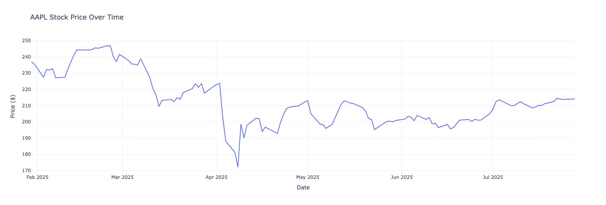
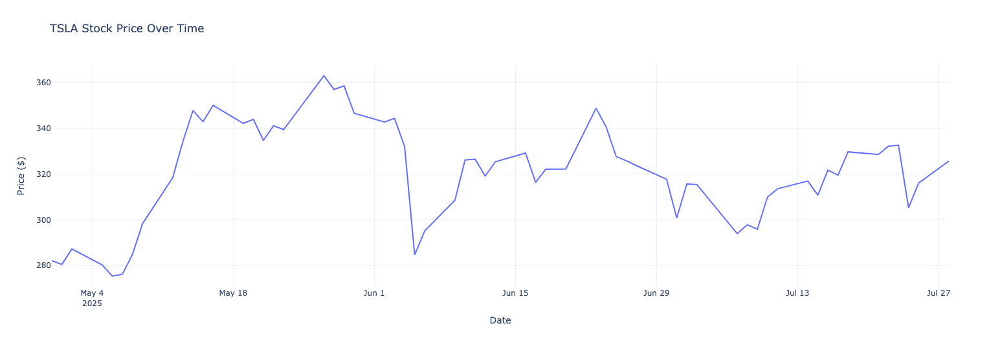
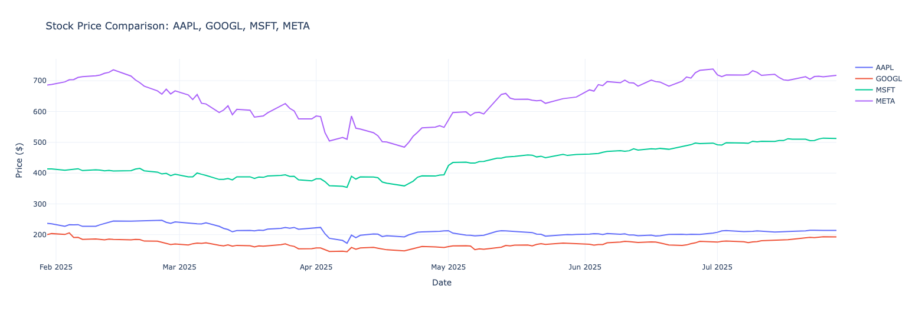

In this cookbook, we'll build a stock market analysis tool that combines the power of Groq's LLM inference with function calling capabilities with observability powered by Maxim AI. Our tool will be able to understand natural language queries about stocks and automatically fetch data, perform analysis, and create beautiful visualizations.

## Prerequisites
- Python 3.8+
- [Groq](https://console.groq.com/home) API key (free at Groq Console)
- [Maxim](https://app.getmaxim.ai/) API key (for logging - Maxim Console)

## Step 1: Setting Up Dependencies

First, let's install all the required packages:

```python
pip install groq yfinance pandas plotly maxim-py
```

**What each package does:**

- `groq`: Fast LLM inference with function calling support
- `yfinance`: Yahoo Finance data retrieval
- `pandas`: Data manipulation and analysis
- `plotly`: Interactive data visualization
- `maxim-py`: AI observability and logging

## Step 2: Environment Setup and API Configuration

```env

MAXIM_API_KEY = "your_maxim_api_key_here"
MAXIM_LOG_REPO_ID = "your_maxim_repo_id_here"
GROQ_API_KEY = "your_groq_api_key_here"
```

## Step 3: Initialize Maxim Logging and Groq Client

```python {12}
import os
from maxim import Config, Maxim
from maxim.logger import LoggerConfig
from maxim.logger.groq import instrument_groq
from groq import Groq

# Initialize Maxim for AI observability
maxim = Maxim(Config(api_key=os.getenv("MAXIM_API_KEY")))
logger = maxim.logger(LoggerConfig(id=os.getenv("MAXIM_LOG_REPO_ID")))

# Set up Groq client with logging instrumentation
instrument_groq(logger)
client = Groq()
```

Why this matters: The Maxim integration gives us detailed insights into our AI model's performance, token usage, and function call patterns - essential for production applications.

## Step 4: Building Core Data Retrieval Functions

### Stock Information Function

```python
import yfinance as yf

def get_stock_info(symbol: str, key: str):
    """Retrieve specific info about a stock"""
    try:
        data = yf.Ticker(symbol)
        return data.info.get(key, f"Key '{key}' not found for symbol '{symbol}'")
    except Exception as e:
        return f"Error retrieving data for {symbol}: {str(e)}"

```

This function fetches specific financial metrics like market cap, beta, P/E ratio, etc.

### Date Parsing for Natural Language

One of the biggest challenges is handling natural language date expressions. Here's our solution:

```python
from datetime import datetime, timedelta
import re

def parse_relative_date(date_str: str) -> str:
    """Convert relative date strings to YYYY-MM-DD format"""
    date_str = date_str.lower().strip()
    today = datetime.now()

    if date_str in ['today', 'now']:
        return today.strftime('%Y-%m-%d')
    elif date_str == 'yesterday':
        return (today - timedelta(days=1)).strftime('%Y-%m-%d')
    elif 'month' in date_str:
        # Extract number of months
        numbers = re.findall(r'\d+', date_str)
        months = int(numbers[0]) if numbers else 1
        # Approximate months as 30 days each
        return (today - timedelta(days=months * 30)).strftime('%Y-%m-%d')
    elif 'week' in date_str:
        numbers = re.findall(r'\d+', date_str)
        weeks = int(numbers[0]) if numbers else 1
        return (today - timedelta(weeks=weeks)).strftime('%Y-%m-%d')
    elif 'day' in date_str:
        numbers = re.findall(r'\d+', date_str)
        days = int(numbers[0]) if numbers else 1
        return (today - timedelta(days=days)).strftime('%Y-%m-%d')
    elif 'year' in date_str:
        numbers = re.findall(r'\d+', date_str)
        years = int(numbers[0]) if numbers else 1
        return (today - timedelta(days=years * 365)).strftime('%Y-%m-%d')
    else:
        # Try to parse as regular date, if it fails return as-is
        try:
            parsed_date = datetime.strptime(date_str, '%Y-%m-%d')
            return date_str
        except:
            # If all else fails, assume it's today
            return today.strftime('%Y-%m-%d')
```

Key insight: This function transforms user-friendly expressions like "6 months ago" into API-compatible date formats.

### Historical Price Data Function

```python
def get_historical_price(symbol: str, start_date: str, end_date: str):
    """Retrieve historical stock price data"""
    try:
        # Parse relative dates
        parsed_start = parse_relative_date(start_date)
        parsed_end = parse_relative_date(end_date)

        print(f"Parsed dates: {start_date} -> {parsed_start}, {end_date} -> {parsed_end}")

        hist = yf.Ticker(symbol).history(start=parsed_start, end=parsed_end).reset_index()
        hist[symbol] = hist['Close']
        return hist[['Date', symbol]].to_dict(orient='records')
    except Exception as e:
        return f"Error retrieving historical data: {str(e)}"

```

## Step 5: Creating Stunning Visualizations

```python
import pandas as pd
import plotly.graph_objects as go

def plot_stock_price(data: list, symbol: str, title: str = None):
    """Plot stock price data using plotly"""
    if isinstance(data, str):  # Error message
        print(f"Cannot plot: {data}")
        return None

    df = pd.DataFrame(data)
    df['Date'] = pd.to_datetime(df['Date'])

    if title is None:
        title = f"{symbol} Stock Price Over Time"

    fig = go.Figure()
    fig.add_trace(go.Scatter(
        x=df['Date'],
        y=df[symbol],
        mode='lines',
        name=f'{symbol} Price',
        line=dict(width=2)
    ))

    fig.update_layout(
        title=title,
        xaxis_title="Date",
        yaxis_title="Price ($)",
        hovermode='x unified',
        template='plotly_white'
    )

    fig.show()
    return fig

def compare_stocks(symbols: list, start_date: str, end_date: str):
    """Compare multiple stocks on the same chart"""
    fig = go.Figure()

    for symbol in symbols:
        data = get_historical_price(symbol, start_date, end_date)
        if isinstance(data, str):  # Error message
            print(f"Skipping {symbol}: {data}")
            continue

        df = pd.DataFrame(data)
        df['Date'] = pd.to_datetime(df['Date'])

        fig.add_trace(go.Scatter(
            x=df['Date'],
            y=df[symbol],
            mode='lines',
            name=f'{symbol}',
            line=dict(width=2)
        ))

    fig.update_layout(
        title=f"Stock Price Comparison: {', '.join(symbols)}",
        xaxis_title="Date",
        yaxis_title="Price ($)",
        hovermode='x unified',
        template='plotly_white'
    )

    fig.show()
    return fig
```

**Why Plotly:** Interactive charts that users can zoom, pan, and hover for details - much better than static matplotlib charts.

## Step 6: Defining Function Schemas for Groq

This is where the magic happens. We define our functions in a schema that Groq can understand:

```python
functions = [
    {
        "type": "function",
        "function": {
            "name": "get_stock_info",
            "description": "Retrieve specific info about a stock",
            "parameters": {
                "type": "object",
                "properties": {
                    "symbol": {"type": "string", "description": "Stock ticker like AAPL or GOOGL"},
                    "key": {"type": "string", "description": "The financial attribute to retrieve (e.g., 'marketCap', 'beta', 'currentPrice')"}
                },
                "required": ["symbol", "key"]
            }
        }
    },
    {
        "type": "function",
        "function": {
            "name": "get_historical_price",
            "description": "Retrieve historical stock price data. Accepts both absolute dates (YYYY-MM-DD) and relative dates (like '6 months ago', 'today', '1 year ago', etc.)",
            "parameters": {
                "type": "object",
                "properties": {
                    "symbol": {"type": "string", "description": "Stock ticker symbol"},
                    "start_date": {"type": "string", "description": "Start date in YYYY-MM-DD format OR relative date like '6 months ago', '1 year ago'"},
                    "end_date": {"type": "string", "description": "End date in YYYY-MM-DD format OR relative date like 'today', 'yesterday'"}
                },
                "required": ["symbol", "start_date", "end_date"]
            }
        }
    }
]

```

**Critical detail:** Notice how we explicitly mention that relative dates are accepted. This guides the AI on how to use our functions.

## Step 7: The Brain - Function Execution Handler

```python
import json

def execute_function_call(function_name: str, arguments: dict):
    """Execute the appropriate function based on the function call"""
    if function_name == "get_stock_info":
        return get_stock_info(**arguments)
    elif function_name == "get_historical_price":
        return get_historical_price(**arguments)
    else:
        return f"Unknown function: {function_name}"

```

This simple dispatcher routes function calls to the appropriate Python functions.

## Step 8: The Complete Query Processing Engine

Here's where everything comes together:

```python
def process_stock_query(query: str, plot_chart: bool = True):
    """Process a stock query and optionally plot results"""

    # Enhanced system message with date handling instructions
    system_message = """You are a financial assistant. Use the available tools to get stock information and provide helpful analysis.

For date parameters in get_historical_price:
- You can use relative dates like: "6 months ago", "1 year ago", "3 weeks ago", "today", "yesterday"
- Or absolute dates in YYYY-MM-DD format
- The function will automatically parse relative dates to the correct format

Be helpful and provide insightful analysis of the stock data you retrieve."""

    # Get initial response from Groq
    response = client.chat.completions.create(
        model="llama-3.3-70b-versatile",
        messages=[
            {"role": "system", "content": system_message},
            {"role": "user", "content": query}
        ],
        tools=functions,
    )

    messages = [
        {"role": "system", "content": system_message},
        {"role": "user", "content": query}
    ]

    # Process tool calls if any
    if response.choices[0].message.tool_calls:
        messages.append(response.choices[0].message)

        for tool_call in response.choices[0].message.tool_calls:
            function_name = tool_call.function.name
            arguments = json.loads(tool_call.function.arguments)

            print(f"Calling function: {function_name} with arguments: {arguments}")

            # Execute the function
            function_result = execute_function_call(function_name, arguments)

            # Add function result to messages
            messages.append({
                "role": "tool",
                "tool_call_id": tool_call.id,
                "content": str(function_result)
            })

            # If it's historical price data and plotting is requested, create a chart
            if function_name == "get_historical_price" and plot_chart and not isinstance(function_result, str):
                symbol = arguments.get('symbol', 'Unknown')
                plot_stock_price(function_result, symbol)

        # Get final response with function results
        final_response = client.chat.completions.create(
            model="llama-3.3-70b-versatile",
            messages=messages,
            tools=functions,
        )

        return final_response.choices[0].message.content
    else:
        return response.choices[0].message.content

```

**The flow:**

1. Send user query to Groq
2. If Groq decides to call functions, execute them
3. Send results back to Groq for final analysis
4. Automatically create charts for historical data
5. Return comprehensive analysis

## Step 9: Testing Our Creation

Let's put our system through its paces:

```python
# Test 1: Simple stock info query
print("=== Stock Info Query ===")
result1 = process_stock_query("What is the beta of Meta stock?", plot_chart=False)
print(result1)
print()

# Test 2: Historical data with automatic chart
print("=== Historical Price with Chart ===")
result2 = process_stock_query("Show me Apple's stock price for the last 6 months", plot_chart=True)
print(result2)
print()

# Test 3: Complex analysis
print("=== Complex Analysis ===")
result3 = process_stock_query(
    "Get Tesla's stock price data for the last 3 months and tell me about its recent performance",
    plot_chart=True
)
print(result3)
```

LLM Response for Apple's stock price:

```text
Based on the historical price data for Apple's stock over the last 6 months, we can see that the stock price has been quite volatile. The price has fluctuated between a high of $245.51 and a low of $172.19.

The stock price started the year at around $237.02 and initially trended downwards, reaching a low of $172.19 in mid-April. However, the price then rebounded and trended upwards, reaching a high of $245.51 in late May.

Since then, the stock price has been trading in a range between $195 and $215. The current price is around $214.05, which is close to the upper end of this range.

Overall, the historical price data suggests that Apple's stock has been quite volatile over the last 6 months, with significant fluctuations in price. However, the stock has shown a general trend of recovery and growth since the mid-April low.

It's worth noting that the stock price can be affected by a wide range of factors, including company performance, industry trends, economic conditions, and market sentiment. As such, it's always important to do your own research and consult with a financial advisor before making any investment decisions.

In terms of analysis, the stock's volatility can be measured using various metrics such as beta, which measures the stock's sensitivity to market movements. Apple's beta is around 1.2, which means that the stock tends to be more volatile than the overall market.

The stock's valuation can also be analyzed using metrics such as price-to-earnings (P/E) ratio, which is around 25. This suggests that the stock is trading at a premium to its historical average, which could indicate that the market is expecting strong growth from the company.

Overall, while the historical price data provides some insights into the stock's behavior, it's always important to consider a wide range of factors and do your own research before making any investment decisions.
```


LLM Response for Tesla's stock price:

```text
Based on the historical price data, Tesla's stock price has been quite volatile over the last 3 months. The stock price has fluctuated between a high of $362.89 and a low of $275.35. 

The stock started the 3-month period at around $282.16 and initially declined to $275.35. Then it started to rise, reaching a peak of $362.89. However, the stock price has been declining since then and is currently trading at around $325.59.

The overall trend of the stock price over the last 3 months is slightly positive, with the stock gaining about 15%. However, the stock's volatility and recent decline suggest that investors should exercise caution and keep a close eye on the stock's performance. 

It's also important to consider other factors such as the company's financial health, industry trends, and overall market conditions when making investment decisions.
```


Stock Comparison Plot:



## Maxim Observability


## Conclusion
We've built a powerful, AI-driven stock market analysis tool that demonstrates the incredible potential of combining fast LLM inference with function calling. The system understands natural language, fetches real-time data, creates beautiful visualizations, and provides intelligent analysis - all from simple English queries.

## Resources
- Sign up on [Maxim AI](https://getmax.im/groq-repo)
- Cookbook for Maxim with Groq [here](https://getmax.im/groq-cookbook)
